### 快速入门


#### 1.0 前提条件

在开始阅读本文之前，希望读者能对以下知识点有基本的了解。我们可能会在文中用到以下各点中的内容，
但不会重复这些知识点。您可能需要先阅读下列文档并熟悉一下基本知识再继续。


##### 1.1 Maven

本项目使用[Apache Maven](http://maven.apache.org/)构建，并且会使用到[spring-boot的maven插件](http://docs.spring.io/spring-boot/docs/1.4.4.RELEASE/maven-plugin/)来
快速启动一个子项目。

如果您只是想了解OAuth2或者直接使用本项目，则不需要对Maven有很深入的了解，只需要知道如何使用Maven命令即可。
如果您是一位架构师，想要更深入地了解本项目并化为己用，则建议您先对Maven有一个深刻的了解。
请参阅Maven的官方文档或相应的书籍，譬如《Mastering Apache Maven 3》等。

我们不会使用IDE或Tomcat来部署项目，而会使用spring-boot的maven插件来快速启动。
如果您对这个插件不太了解的话，您只要知道使用Maven命令`mvn spring-boot:run`就可以快速启动当前目录下的项目。
原理是spring-boot的maven插件会去运行项目的`pom.xml`中指定的嵌入式Tomcat。
更详细的说明请参阅[官方文档](http://docs.spring.io/spring-boot/docs/1.4.4.RELEASE/maven-plugin/)。

如果您没有在本机上安装maven，我们在每个子项目目录下为您准备了Maven wrapper。
直接`cd`到各子项目目录下后，即可使用`mvnw.cmd`（Linux或者Mac系统下为`./mvnw`）命令替代
文中提到的任何以`mvn`开头的Maven命令而无需在本机上安装Maven。

另外，本项目的主要子项目`oauth2-server-boot`被设定为构建成`war`包，您可以将构建的`war`包
部署到已有的Tomcat服务器上，也可以使用Java命令行`java -jar oauth2-server-boot-xxx.war`来把`war`包
当做`jar`包直接运行。

另外两个子项目`oauth2-client-boot`和`resourceserver`被设定为构建成`jar`包，
所以您无法直接部署这两个项目，只能使用Java命令直接运行（或者亦可在IDE中运行，或使用spring-boot maven插件运行）。


##### 1.2 Spring Boot、Spring Security 以及 Spring Security OAuth

本项目主要使用了以上几个开源框架来进行构建，但本文并不会尝试去讲解Spring、Spring Boot、Spring Security以及Spring Security OAuth相关的基本原理等内容，
但可能会讲到相关部分配置的内容。如果您对上面几个的基本原理等内容感兴趣，请参考官方文档或相应的书籍。

由于大势所趋，本项目使用了Java配置替代XML配置，并且不会讲解相应的XML配置该如何。如需要使用XML配置，
建议您使用`@Import`注解将XML配置导入，或者阅读官方文档寻找相应解决方案。


##### 1.3 Java 8

本项目使用到了Java 8的一些新特性如`stream`、`lambda`、`optional`等。我们默认为读者已经熟知并了解了这些新特性，
所以本文并不会在这里详解这些新特性。如果您对阅读本项目代码不感兴趣可以略过这块。如有问题请参阅官方文档。


##### 1.4 OAuth2

由于本项目是基于OAuth2协议的，所以您至少对OAuth2的[几个认证流程](http://www.dewafer.com/2016/09/19/notes-for-oauth2/)有一个初步的了解。本文肯定会涉及到OAuth2相关的
内容，但并不会深入详解这些内容。请阅读官方文档（[OAuth2官方](https://oauth.net/2/)、[RFC 6749](https://tools.ietf.org/html/rfc6749)）或参阅相关书籍（如《Mastering OAuth2》等）。


##### 1.5 版本号

本项目主要依赖的Spring Boot的版本为`1.4.3.RELEASE`，其他各为定义版本号的依赖由Spring Boot相应版本
下的各starter定义，本项目不指定。更详细的内容请参考Spring Boot的[相应Starter](https://github.com/spring-projects/spring-boot/tree/master/spring-boot-starters)或者本项目各子项目下的`pom.xml`中的内容。

由于本项目的代码中使用了Java 8的`stream`、`lambda`、`optional`等特性，所以Java的版本号限定在8.0，不支持8.0（1.8）以下的任何版本，并且推荐使用update 111以上的版本（u111之前的`lambda`有一些已知的问题）


#### 2.0 动手跑起来

##### 2.1 签出项目

首先使用

```bash
git clone https://github.com/newnil/oauth2-family-barrel.git
```

签出项目到`oauth2-family-barrel`目录下。如果你没有git，也可以从这里[下载项目源代码](https://github.com/newnil/oauth2-family-barrel/archive/master.zip)后解压缩到相应目录下。


##### 2.2 构建整个项目

然后`cd`到项目根目录下

```bash
cd oauth2-family-barrel
```

使用Maven命令进行构建

```bash
mvn clean install -DskipTests
```

等待命令行出现`BUILD SUCCESS`提示（如下图所示），则说明项目构建成功。第一次构建需要下载依赖`jar`包，
如果您在国内并且未设置阿里云的Maven仓库镜像的话，则构建速度会比较慢。这里我们为Maven加上了`-DskipTests`
参数来跳过测试以加快构建速度。

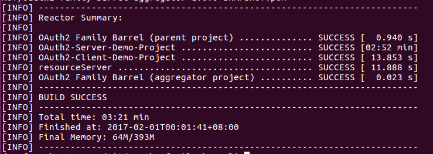

由于各个子项目间可能会有互相依赖的情况出现，所以从根项目开始构建整个项目这一步是必须的。


##### 2.3 启动`oauth2-server-boot`

`oauth2-server-boot`是整个项目的核心，它提供了用户账户、OAuth2授权以及各种OAuth2客户端管理等的功能。
我们首先来启动它。

从项目根目录`cd`到`oauth2-server-boot`子目录，

```bash
cd oauth2-server-boot
```

使用

```bash
mvn spring-boot:run
```

命令启动该项目，命令行会翻滚好几页，最后应该显示如下图所示，则说明启动成功。

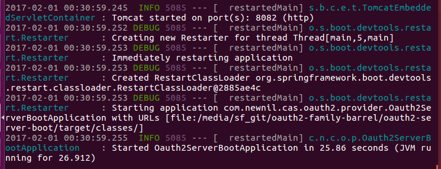

可以从提示上看到，嵌入式Tomcat启动在本地`8082`端口上，
此时可以通过浏览器访问[http://localhost:8082/security](http://localhost:8082/security)来访问本服务，如下图所示。

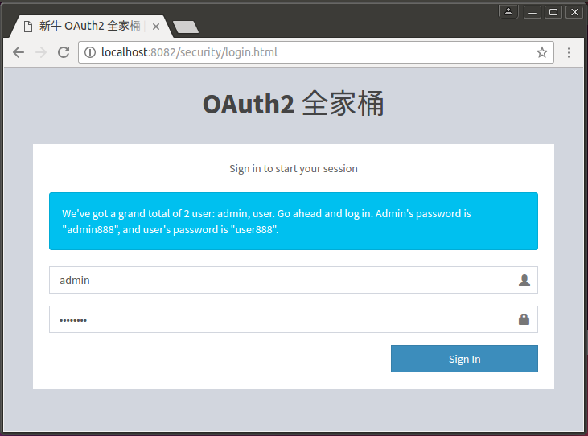

作为一个演示项目，我们很贴心地为您填好了用户名以及密码（如果需要，可以在相应的`/oauth2-server-boot/src/main/resources/templates/login.html`文件中移除相应的内容）。直接点击`Sign in`按钮即可登录。

登录后，显示的是我们的Dashboard，如下图所示。

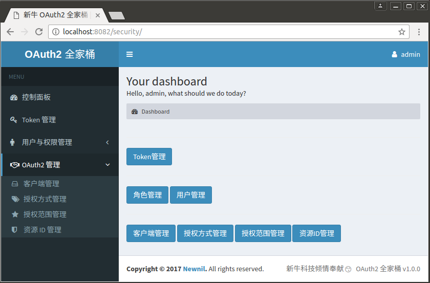

可以看到服务端为我们提供了OAuth2相关的各种管理功能。
我们稍后再来解释其中的详细内容，先来启动客户端。

##### 2.4 启动`oauth2-client-boot`

`oauth2-client-boot`客户端是一个仅做演示功能的小app，并没有很复杂的功能。它本身并不持有用户账户的信息，
通过和`oauth2-server-boot`服务端进行基于RESTful的交互来为鉴明用户真身以及获取当前用户的详情。

首先来启动它。因为前一个命令行窗口已经被`oauth2-server-boot`服务占用了，我们需要另外启动一个命令行窗口，
从项目根目录`cd`到`oauth2-client-boot`子目录

```bash
cd oauth2-client-boot
```

使用

```bash
mvn spring-boot:run
```

命令启动，命令行窗口显示应该和`oauth2-server-boot`类似，但启动在不同的8080端口上。如下图所示。

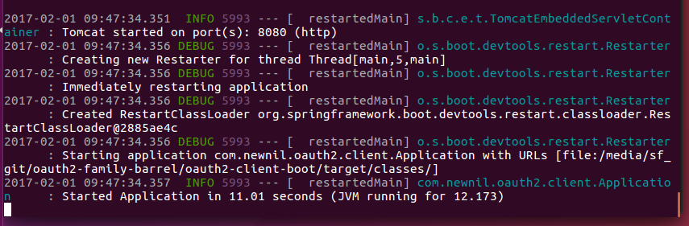

此时，使用浏览器访问[http://localhost:8080](http://localhost:8080)会跳转并显示一个如下图所示的授权页面。
如果你之前未登录服务器端，将会跳转到之前图显示的全家桶登录页面，登录之后也会再跳转到下图显示的授权页面。

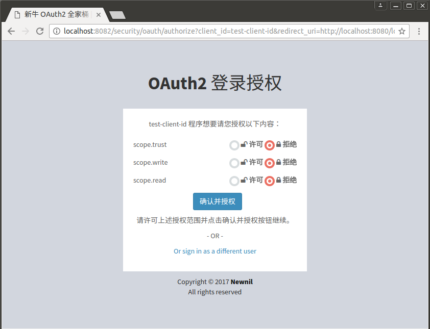

注意浏览器地址栏显示的不是`http://localhost:8080`，而是
`http://localhost:8082/security/oauth/authorize?client_id=...`。（如果您之前未在服务端登录，
此时应该也会跳转到服务端的登录页面。）这是由于OAuth2协议规定登录、授权都是用中央服务器完成的，
客户端并不经手用户的鉴权信息。所以我们会被跳转到服务器端进行登录授权。

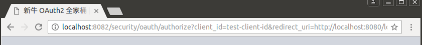

许可页面上所有内容并点击“确认并授权”按钮后，我们会跳转回真正的客户端页面，如下图所示，
注意浏览器地址栏上的地址为`http://localhost:8080`。

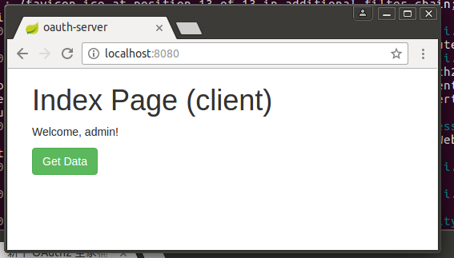

由于只是个演示app所以页面显得相当简陋。页面上有个“Get Data”按钮，如果你点击这个按钮的话，
客户端会使用`RestTemplate`去访问`ResourceServer`并获取一段类似Hello World的消息并显示在页面上。

`oauth2-client-boot`和`ResourceServer`本身并不持有用户的账号信息，它俩通过与`oauth2-server-boot`进行
RESTful通信来获取用户的授权以及用户本身的详情。类似常用的场景有CAS中央鉴权服务、第三方授权登录（如“使用新浪微博登录”）等。
用户通过中央鉴权授权服务器（`oauth2-server-boot`）对第三方客户端（`oauth2-client-boot`）授权访问受保护的资源（`ResourceServer`）。

这时如果我们点击“Get Data”按钮，将会显示一个错误白页面，这是因为我们还未启动受保护资源服务器，
客户端访问不到该资源所导致的。我们现在就来启动它。


##### 2.5 启动 `ResourceServer`

启动受保护资源服务器的步骤和启动OAuth2服务器与客户端的方式一样，首先从项目根目录`cd`到`ResourceServer`子目录
（你可能需要重新启动一个命令行窗口）

```bash
cd resourceserver
```

然后使用

```bash
mvn spring-boot:run
```

命令启动，命令行窗口显示应该和`oauth2-server-boot`类似，但启动在不同的8083端口上。如下图所示。

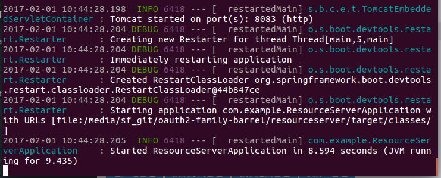

由于`resourceserver`是个受保护的资源服务器，仅提供受安全保护的API并不提供可视化的访问页面，所以无法通过浏览器访问。
我们需要通过`oauth2-client-boot`来访问它。

回到`oauth2-client-boot`的首页，此时再点击“Get Data”按钮金辉跳转到一个消息页面，如下图所示。
图中的消息是`oauth2-client-boot`通过携带由`oauth2-server-boot`分发的token来远程访问
`resourceserver`服务器的受保护的API所获取的简单消息。


`resourceserver`并不直接接触用户的详细信息也不会对用户进行鉴权操作，
所有这些操作都是通过与`oauth2-server-boot`通信来完成的。


#### 3.0 总结


通过这样一个演示操作，我们完成了一整套授权方式为`Authorization Code Grant`的授权流程，如下图所示。
（根据RFC 6749的定义，OAuth2的授权方式一共有5种，`Authorization Code Grant`为其中最复杂也是安全性最高的一种）

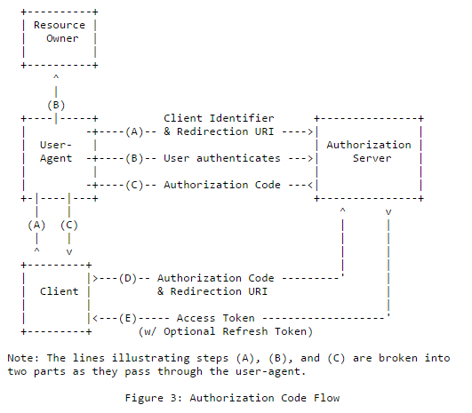

图中的`User-Agent`和`Client`可以理解为用户的浏览器和我们的`oauth2-client-boot`服务器；
图中的`Authorization Server`即我们的`oauth2-server-boot`；
图中的`Resource Owner`即我们的`resourceserver`。

通过上述流程授权后，我们也可以通过访问[oauth2-server-boot的Token管理](http://localhost:8082/security/oauth/tokens)
页面查看服务端对客户端授权的token；亦可在该页面撤销(Revoke)该token。

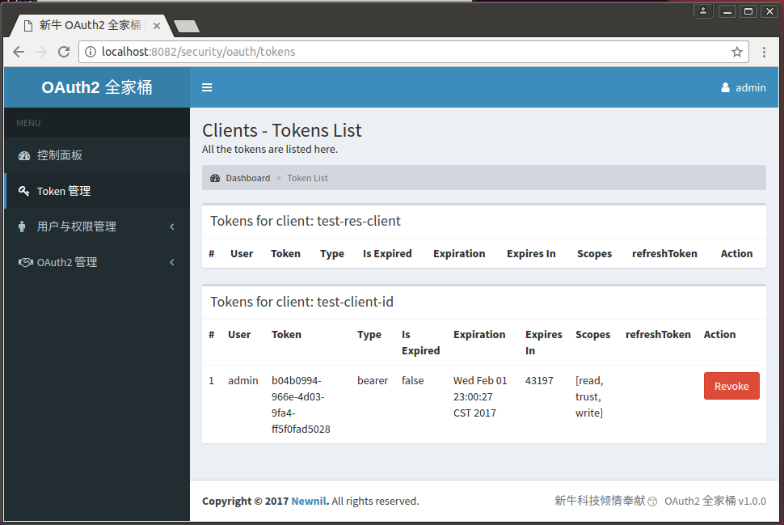

`oauth2-server-boot`服务端对客户端`oauth2-client-boot`授权的token是不带刷新token的持久token。
也就是说，如果此时你关闭所有浏览器让用户会话失效，然后重新打开访问[http://localhost:8080](http://localhost:8080)，
你会发现重新登录完之后并不会显示授权页面，而是直接跳转回“Get Data”页面。点击“Get Data”按钮也可正常访问`resourceserver`。
这个持久token在过期之前将一直有效，除非用户自行在token管理中Revoke该token。

另外，这个token是保存在`oauth2-client-boot`服务器的远端的，用户浏览器本地并不会持有该token。
所以除非服务器被渗透、或管理端有意泄露，否则该token是无法被获取到的。也就是说使用通过OAuth2用户授权的安全性能够得到保障。
